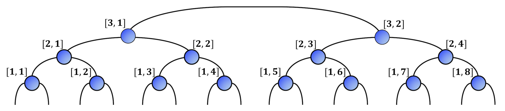
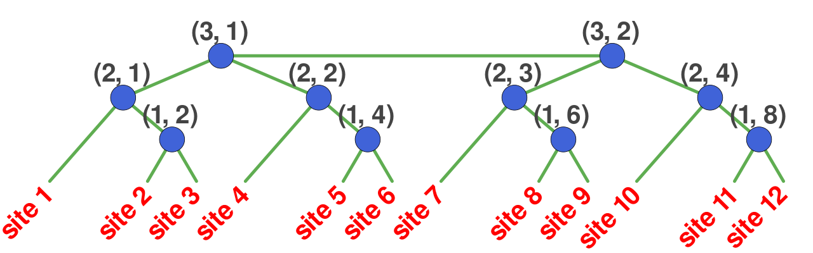
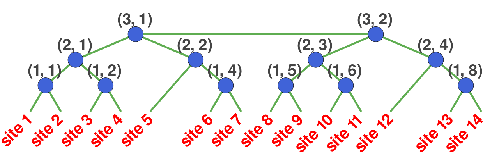

# Tree Tensor Networks (TTN)


Tree Tensor Network (TTN) is a loop-free hierarchical tensor network (see belew).


| Tree Tensor Network for a system of size 16 |
|-------------------------|
|  |

Due to enhanced connectivity in the structure of TTN, it can support long-range
quantum correlations comapred to MPS. Moreover, simulations for systems with periodic boundary conditions (PBC) are almost as efficient as the same with open boundary conditions (OBC).
TTNs have found their place for simulating 2D or pseudo-2D ladder/cylinder systems with PBC
where the performance of MPS is not adequate.

TeNLib.jl implements the unconstrained optimization for obtaining
ground as well as excited states as
described in [Phys. Rev. B **90**, 125154 (2014)](https://journals.aps.org/prb/abstract/10.1103/PhysRevB.90.125154) and [SciPost Phys. Lect. Notes 8 (2019)] (https://scipost.org/10.21468/SciPostPhysLectNotes.8).

---

Each tensor in the TTN are indexed by a pair (`Tuple`) of `Int`s = `(ll, nn)`.
```
const Int2 = Tuple{Int, Int}
```
In the default scenario, `ll` denotes the layer index and `nn` denotes the tensor index at each layer (see the image above). The counting for `ll`, in the default case, starts at the bottom (towards to top level), while `nn` counts from left. The structure of the network is defined by a
[`Graph{Int2}`](@ref "The Graph object") object.

---

!!! info
    TeNLib.jl can automatically handle system-sizes that are not powers of 2. No special care is
    needed for such system-sizes.

| TTN for system-size 12 | TTN for system-size 14|
|------------------------|-----------------------|
| Sites 1, 4, 7, 11 are directly connected to `ll=2` tensors | Sites 5, 12 are directly connected to `ll=2` tensors |
| Nodes (1,1), (1,3), (1,5), (1,7) are removed | Nodes (1,3), (1,7) are removed | 
|  |  |


!!! info
    The TTN codes defined in TeNLib.jl can readily work, without any changes,
    **for any loop-free tensor networks**, e.g., Fork Tensor Networks.

!!! tip
    For 2D systems, use a mapping from the 2D lattice to a 1D chain using Hilbert curve, as
    shown in [Quantum **5**, 556 (2021)](https://quantum-journal.org/papers/q-2021-09-29-556/)